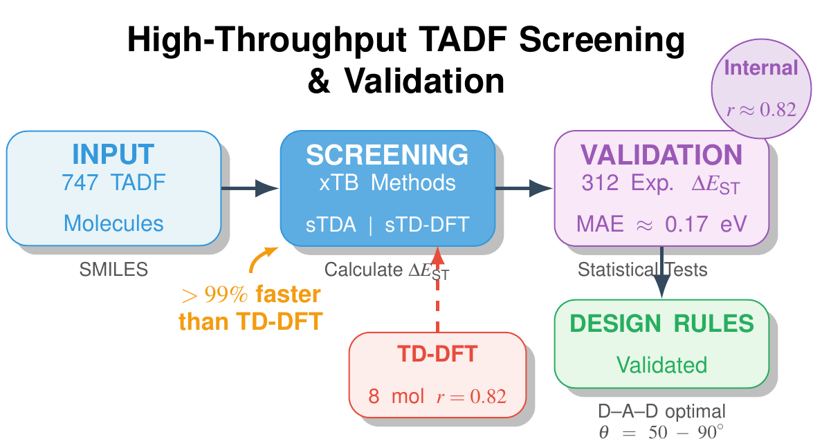

# Article 1: xTB-Based High-Throughput Screening of TADF Emitters: 747-Molecule Benchmark



## Publication Information

**Status:** Published  
**Journal:** Journal of Chemical Information and Modeling (2026)  
**DOI:** [10.1021/acs.jcim.5c02978](https://doi.org/10.1021/acs.jcim.5c02978)  
**arXiv:** [2511.00922](https://arxiv.org/abs/2511.00922)

## Authors

- Jean-Pierre Tchapet Njafa (jean-pierre.tchapet@facsciences-uy1.cm)
- Elvira Vanelle Kameni Tcheuffa
- Aissatou Maghame Foumkpou
- Serge Guy Nana Engo

Department of Physics, Faculty of Science, University of Yaounde I, P.O. Box 812, Yaounde, Cameroon

## Abstract

We validate semi-empirical sTDA-xTB and sTD-DFT-xTB methods for high-throughput screening of thermally activated delayed fluorescence (TADF) emitters using 747 experimentally characterized molecules—the largest such benchmark to date. Our framework achieves >99% computational cost reduction versus TD-DFT while maintaining strong internal consistency (Pearson r ≈ 0.82) and reasonable agreement with 312 experimental singlet-triplet gaps (MAE ≈ 0.17 eV). Large-scale analysis statistically validates key design principles: D-A-D architectures outperform other motifs, and optimal torsional angles of 50–90° maximize TADF efficiency, while PCA confirms a low-dimensional property space. This work establishes xTB methods as cost-effective tools for accelerating TADF discovery.

## Key Findings

- **Largest TADF benchmark:** 747 experimentally characterized molecules
- **Cost reduction:** >99% computational cost reduction compared to TD-DFT
- **Method validation:** Strong internal consistency (r ≈ 0.82) and reasonable experimental agreement (MAE ≈ 0.17 eV)
- **Design principles:** Statistical validation of D-A-D architectures and optimal torsional angles (50–90°)
- **Dimensionality:** PCA confirms low-dimensional property space for TADF emitters

## Highlights

- First comprehensive benchmark of semi-empirical methods for TADF screening
- Enables screening of thousands of candidates at <1% of TD-DFT cost
- Validates key design principles with statistical rigor
- Establishes xTB as reliable tool for TADF discovery

## Manuscript Files

This folder contains:

- `Archive1_xTB-Based-High-Throughput-Screening-of-TADF-Emitters:747-Molecule-Benchmark.tex` - Main manuscript (LaTeX source)
- `Archive1_xTB-Based-High-Throughput-Screening-of-TADF-Emitters:747-Molecule-Benchmark.pdf` - Main manuscript (PDF)
- `SI-Article1-xTB-Based-High-Throughput-Screening-of-TADF-Emitters:747-Molecule-Benchmark.tex` - Supporting Information (LaTeX source)
- `SI-Article1-xTB-Based-High-Throughput-Screening-of-TADF-Emitters:747-Molecule-Benchmark.pdf` - Supporting Information (PDF)
- `TADF_Article_References.bib` - Bibliography file
- `Figures/` - Manuscript figures
- `tables/` - Manuscript tables

## Computational Data and Code

All computational data, scripts, and reproducibility code are available in the companion GitHub repository:

**Repository:** [smiEmpirical-TADF](https://github.com/TchapetNjafa/Data_Articles_TADF)  
**Data Location:** `Public_Results/Result_article1_TADF_xTB/`  
**DOI:** [10.5281/zenodo.17436069](https://doi.org/10.5281/zenodo.17436069)

The repository includes:
- Raw computational data for all 747 molecules (gas phase and toluene)
- Complete computational pipeline (xTB, CREST, sTDA, Multiwfn)
- Machine learning reproducibility code
- High-level theory validation (OT-LC-PBE)

For technical details on software requirements, hardware specifications, and troubleshooting, see the [repository README](https://github.com/TchapetNjafa/Data_Articles_TADF/blob/main/Public_Results/Result_article1_TADF_xTB/README.md).

## Computational Methods

- **Semi-empirical methods:** sTDA-xTB and sTD-DFT-xTB
- **Geometry optimization:** xTB GFN2 with CREST conformer search
- **Excited states:** Simplified TD-DFT for S₁ and T₁ transitions
- **Benchmark:** 747 experimentally characterized TADF molecules
- **Validation:** 312 experimental singlet-triplet gap measurements

## Citation

```bibtex
@article{tchapet2026validation,
  title={xTB-Based High-Throughput Screening of TADF Emitters: 747-Molecule Benchmark},
  author={Tchapet Njafa, Jean-Pierre and Kameni Tcheuffa, Elvira Vanelle and Foumkpou, Aissatou Maghame and Nana Engo, Serge Guy},
  journal={Journal of Chemical Information and Modeling},
  year={2026},
  doi={10.1021/acs.jcim.5c02978}
}
```

## Related Work

This article is part of a two-article series on TADF emitters:

- **Article 1 (this work):** Validates the computational methodology
- **Article 2:** Applies the validated methodology to extract design guidelines and identify high-performance candidates

See the parent folder README for more information.

## License

MIT License

---

*Published: 2026*
