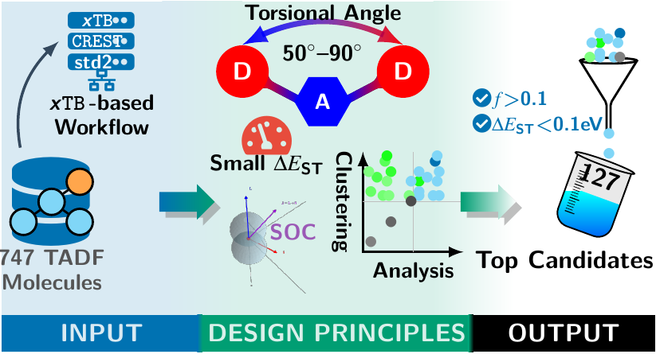

# Article 2: Data-Driven Design Guidelines for TADF Emitters from a High-Throughput Screening of 747 Molecules



## Publication Information

**Status:** Published  
**Journal:** Journal of Chemical Information and Modeling (2026)  
**DOI:** [10.1021/acs.jcim.5c03068](https://doi.org/10.1021/acs.jcim.5c03068)  
**arXiv:** [2511.11606](https://arxiv.org/abs/2511.11606)

## Authors

- Jean-Pierre Tchapet Njafa (jean-pierre.tchapet@facsciences-uy1.cm)
- Elvira Vanelle Kameni Tcheuffa
- Aissatou Maghame Foumkpou
- Serge Guy Nana Engo

Department of Physics, Faculty of Science, University of Yaounde I, P.O. Box 812, Yaounde, Cameroon

## Abstract

TADF emitter performance depends on both thermodynamic and kinetic factors. We analyze 747 experimentally known TADF molecules computationally to extract quantitative design guidelines. Using a validated xTB-based workflow, we examine how architecture, geometry, and electronic structure affect photophysical properties. Among architectures, D-A-D frameworks achieve the smallest ΔE_ST. A favorable torsional angle of 50–90° balances small ΔE_ST with the spin-orbit coupling needed for reverse intersystem crossing. Clustering separates high-performance candidates and highlights multi-resonance emitters for blue emission. From these results, we identify 127 candidates with predicted ΔE_ST < 0.1 eV and oscillator strength f > 0.1. These HTVS-derived design guidelines and candidates can guide future TADF emitter development.

## Key Findings

- **Quantitative design guidelines:** Systematic analysis of 747 TADF molecules reveals structure-property relationships
- **Optimal architecture:** D-A-D frameworks achieve the smallest singlet-triplet gaps
- **Torsional angle window:** 50–90° balances thermodynamic (small ΔE_ST) and kinetic (SOC for RISC) requirements
- **High-performance candidates:** 127 molecules identified with ΔE_ST < 0.1 eV and f > 0.1
- **Multi-resonance emitters:** Clustering analysis highlights promising candidates for blue emission
- **Design principles:** Architecture, geometry, and electronic structure correlations guide rational design

## Highlights

- First data-driven extraction of quantitative TADF design rules from large-scale screening
- Identifies optimal torsional angle range balancing thermodynamic and kinetic factors
- 127 high-performance candidates ready for experimental validation
- Establishes clear structure-property relationships for rational emitter design

## Manuscript Files

This folder contains:

- `Article2-Data-Driven-Design-Guidelines-for-TADF-Emitters-from-a-High-Throughput-Screening-of-747-Molecules.tex` - Main manuscript (LaTeX source)
- `Article2-Data-Driven-Design-Guidelines-for-TADF-Emitters-from-a-High-Throughput-Screening-of-747-Molecules.pdf` - Main manuscript (PDF)
- `SI-Article2-Data-Driven-Design-Guidelines-for-TADF-Emitters-from-a-High-Throughput-Screening-of-747-Molecules.tex` - Supporting Information (LaTeX source)
- `SI-Article2-Data-Driven-Design-Guidelines-for-TADF-Emitters-from-a-High-Throughput-Screening-of-747-Molecules.pdf` - Supporting Information (PDF)
- `TADF_Article_References_article1.bib` - Bibliography file
- `Figures/` - Manuscript figures
- `SI-tex/` - Supporting Information LaTeX files

## Computational Data and Code

All computational data, scripts, and reproducibility code are available in the companion GitHub repository:

**Repository:** [smiEmpirical-TADF](https://github.com/TchapetNjafa/Data_Articles_TADF)  
**Data Location:** `Public_Results/Result_article1_TADF_xTB/`  
**DOI:** [10.5281/zenodo.17436069](https://doi.org/10.5281/zenodo.17436069)

The repository includes:
- Raw computational data for all 747 molecules
- Molecular architecture classification and analysis
- Machine learning models for property prediction
- Complete analysis scripts and notebooks

For technical details on software requirements, hardware specifications, and troubleshooting, see the [repository README](https://github.com/TchapetNjafa/Data_Articles_TADF/blob/main/Public_Results/Result_article1_TADF_xTB/README.md).

## Methodology

This work builds on the validated computational framework from Article 1:

- **Computational workflow:** xTB-based high-throughput screening (validated in Article 1)
- **Dataset:** 747 experimentally characterized TADF molecules
- **Analysis approach:** Systematic examination of architecture, geometry, and electronic structure
- **Design principles:** Quantitative structure-property relationships
- **Candidate identification:** Data-driven screening for high-performance emitters

## Design Guidelines Summary

1. **Architecture:** D-A-D frameworks preferred for minimal ΔE_ST
2. **Torsional angle:** 50–90° optimal range for balancing thermodynamic and kinetic factors
3. **Electronic structure:** Proper HOMO-LUMO separation and overlap control
4. **Multi-resonance:** Alternative pathway for blue emission with rigid structures
5. **Screening criteria:** ΔE_ST < 0.1 eV and oscillator strength f > 0.1

## Citation

```bibtex
@article{tchapet2026design,
  title={Data-Driven Design Guidelines for TADF Emitters from a High-Throughput Screening of 747 Molecules},
  author={Tchapet Njafa, Jean-Pierre and Kameni Tcheuffa, Elvira Vanelle and Foumkpou, Aissatou Maghame and Nana Engo, Serge Guy},
  journal={Awaiting publication},
  year={2026},
  note={arXiv:2511.11606}
}
```

## Related Work

This article is part of a two-article series on TADF emitters:

- **Article 1:** Validates the xTB-based computational methodology used in this work
- **Article 2 (this work):** Applies the validated methodology to extract design guidelines

See the parent folder README for more information.

## License

MIT License

---

*Published: 2026*
